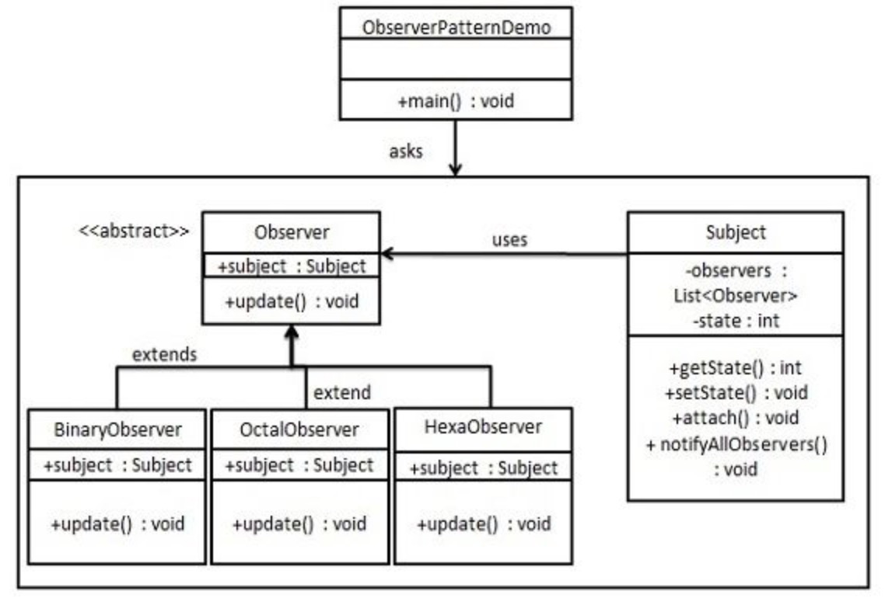

观察者模式

当对象间存在一对多关系时，则使用观察者模式（Observer Pattern）。
比如，[当一个对象被修改时，则会自动通知依赖它的对象]。观察者模式属于行为型模式。

介绍
意图：定义对象间的一种一对多的依赖关系，当一个对象的状态发生改变时，所有依赖于它的对象都得到通知并被自动更新。
主要解决：一个对象状态改变给其他对象通知的问题，而且要考虑到易用和低耦合，保证高度的协作。
何时使用：一个对象（目标对象）的状态发生改变，所有的依赖对象（观察者对象）都将得到通知，进行广播通知。
如何解决：使用面向对象技术，可以将这种依赖关系弱化。
关键代码：在抽象类里有一个 ArrayList 存放观察者们。
优点： 
    1、观察者和被观察者是抽象耦合的。 
    2、建立一套触发机制。
缺点： 
    1、如果一个被观察者对象有很多的直接和间接的观察者的话，将所有的观察者都通知到会花费很多时间。 
    2、如果在观察者和观察目标之间有循环依赖的话，观察目标会触发它们之间进行循环调用，可能导致系统崩溃。 
    3、观察者模式没有相应的机制让观察者知道所观察的目标对象是怎么发生变化的，而仅仅只是知道观察目标发生了变化。
使用场景：
一个抽象模型有两个方面，其中一个方面依赖于另一个方面。将这些方面封装在独立的对象中使它们可以各自独立地改变和复用。
一个对象的改变将导致其他一个或多个对象也发生改变，而不知道具体有多少对象将发生改变，可以降低对象之间的耦合度。
一个对象必须通知其他对象，而并不知道这些对象是谁。
需要在系统中创建一个触发链，A对象的行为将影响B对象，B对象的行为将影响C对象……，可以使用观察者模式创建一种链式触发机制。
注意事项： 
    1 [JAVA 中已经有了对观察者模式的支持类]
    2、避免循环引用。 
    3、如果顺序执行，某一观察者错误会导致系统卡壳，一般采用异步方式。

    
java 机制：
[示例](https://segmentfault.com/a/1190000016879322)
[示例](https://www.cnblogs.com/zchok/p/11388932.html)


示例代码：
观察者模式使用三个类 Subject[被观察对象]、Observer[观察者抽象]
我们创建 Subject 类、Observer 抽象类和扩展了抽象类 Observer 的实体类。


创建 Subject 类
```java
public class Subject {
   //所有的观察对象
   private List<Observer> observers = new ArrayList<Observer>();
   private int state;
 
   public void setState(int state) {    //设置状态，激活观察者
      this.state = state;
      notifyAllObservers();
   }
 
   //绑定观察者
   public void attach(Observer observer){
      observers.add(observer);      
   }

   //激活观察者
   public void notifyAllObservers(){
      for (Observer observer : observers) {
         observer.update();
      }
   }  
}
```

创建 Observer 类
```java
/**观察者抽象*/
public abstract class Observer {
   protected Subject subject;
   public abstract void update();
}
```

创建实体观察者类
```java
public class BinaryObserver extends Observer{
   public BinaryObserver(Subject subject){
      this.subject = subject;
      this.subject.attach(this); //将当前对象添加到观察者集合中
   }
 
   @Override
   public void update() {
      System.out.println( "Binary String: " + Integer.toBinaryString( subject.getState() ) ); 
   }
}

public class OctalObserver extends Observer{
   public OctalObserver(Subject subject){
      this.subject = subject;
      this.subject.attach(this); //将当前对象添加到观察者集合中
   }
 
   @Override
   public void update() {
     System.out.println( "Octal String: " + Integer.toOctalString( subject.getState() ) ); 
   }
}
```

使用 Subject 和实体观察者对象
```java
public class ObserverPatternDemo {
   public static void main(String[] args) {
      Subject subject = new Subject();
 
      //绑定观察者
      new OctalObserver(subject);
      new BinaryObserver(subject);
 
      System.out.println("First state change: 15");   
      subject.setState(15);
      System.out.println("Second state change: 10");  
      subject.setState(10);
   }
}
```

执行程序，输出结果
```text
First state change: 15
Octal String: 17
Binary String: 1111

Second state change: 10
Octal String: 12
Binary String: 1010
```