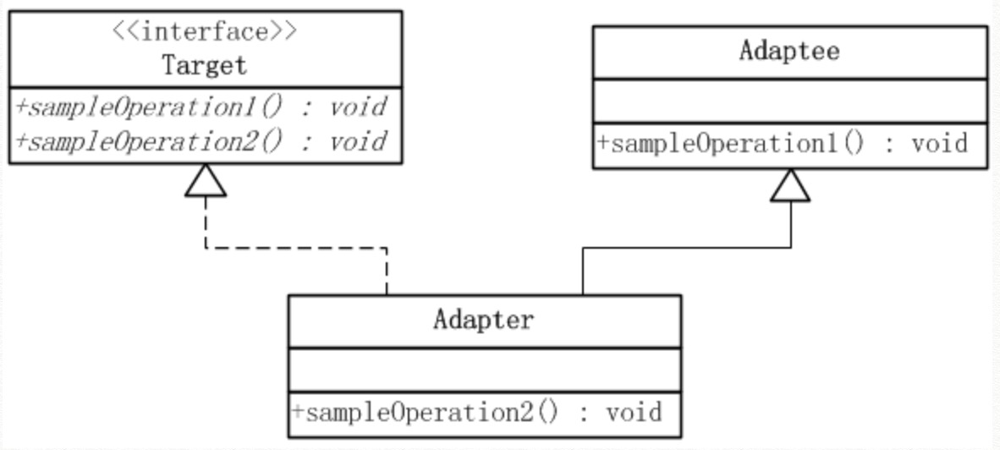
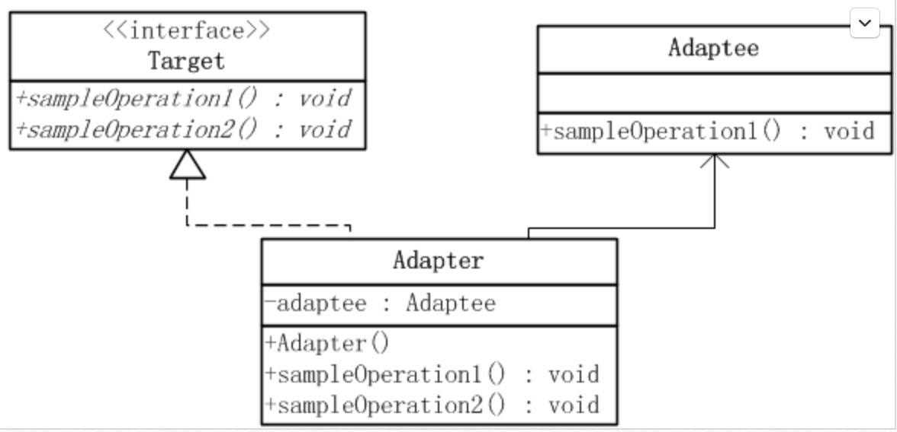

适配器模式

适配器模式（Adapter Pattern）是作为[两个不兼容的接口之间的桥梁]。这种类型的设计模式属于结构型模式，它结合了两个独立接口的功能。
适配器模式有 类的适配器模式 和 对象的适配器模式 两种不同的形式。

介绍
意图：将一个类的接口转换成客户希望的另外一个接口。适配器模式使得原本由于接口不兼容而不能一起工作的那些类可以一起工作。
主要解决：主要解决在软件系统中，常常要将一些"现存的对象"放到新的环境中，而新环境要求的接口是现对象不能满足的。
何时使用： 
    1、系统需要使用现有的类，而此类的接口不符合系统的需要。 
    2、想要建立一个可以重复使用的类，用于与一些彼此之间没有太大关联的一些类，包括一些可能在将来引进的类一起工作，这些源类不一定有一致的接口。 
    3、通过接口转换，将一个类插入另一个类系中。（比如老虎和飞禽，现在多了一个飞虎，在不增加实体的需求下，增加一个适配器，在里面包容一个虎对象，实现飞的接口。）

如何解决：继承或依赖（推荐）。
关键代码：适配器继承或依赖已有的对象，实现想要的目标接口。

优点： 
    1、可以让任何两个没有关联的类一起运行。 
    2、提高了类的复用。 
    3、增加了类的透明度。 
    4、灵活性好。
    
缺点： 
    1、过多地使用适配器，会让系统非常零乱，不易整体进行把握。
        比如，明明看到调用的是 A 接口，其实内部被适配成了 B 接口的实现，一个系统如果太多出现这种情况，无异于一场灾难。
        因此如果不是很有必要，可以不使用适配器，而是直接对系统进行重构。 
    2.由于 JAVA 至多继承一个类，所以至多只能适配一个适配者类，而且目标类必须是抽象类。
    
使用场景：有动机地修改一个正常运行的系统的接口，这时应该考虑使用适配器模式。
注意事项：适配器不是在详细设计时添加的，而是解决正在服役的项目的问题。

代码示例：
类的适配器模式


在上图中可以看出：
Adaptee类并没有sampleOperation2()方法，而客户端则期待这个方法。
为使客户端能够使用Adaptee类，提供一个中间环节，即类Adapter，把Adaptee的API与Target类的API衔接起来。

Adapter与Adaptee是继承关系，这决定了这个适配器模式是类的
* 目标(Target)角色：这就是所期待得到的接口。[注意：由于这里讨论的是类适配器模式，因此目标不可以是类]
* 源(Adapee)角色：现在需要适配的接口。
* 适配器(Adaper)角色：适配器类是本模式的核心。适配器把源接口转换成目标接口。显然，这一角色不可以是接口，而必须是具体类。

示例代码：[客户希望通过一个接口得到：类Adapteee中的sampleOperation1方法，以及没有的sampleOperation2方法]
```java
/**源角色, 现在已有*/
public class Adaptee {
    public void sampleOperation1(){}
}

/**目标接口, 想要结果, 自定义*/
public interface Target {
    //源类Adaptee存在的方法
    void sampleOperation1(); 

    //需要适配的方法
    void sampleOperation2(); 
}
```

解决：适配器角色Adapter继承了Adaptee, 同时又实现了目标(Target)接口。[沿用源中存在的，实现不存在的]
```java
/**适配器*/
public class Adapter extends Adaptee implements Target {
    //1.sampleOperation1方法源中有，已继承
    //2.sampleOperation2需要适配器实现
    @Override
    public void sampleOperation2() {
        //写相关的代码
    }
}

/**使用*/
public class AdapterPattern {
    public static void main(String[] args) {
        Target target = new Adapter();
        target.sampleOperation1();
        target.sampleOperation2();
    }
}
```


对象的适配器模式


从上图可以看出：
Adaptee类并没有sampleOperation2()方法，而客户端则期待这个方法。
为使客户端能够使用Adaptee类，需要提供一个包装(Wrapper)类Adapter。
这个包装类包装了一个Adaptee的实例，从而此包装类能够把Adaptee的API与Target类的API衔接起来。

Adapter与Adaptee是委派关系，这决定了适配器模式是对象的。

示例代码：[客户希望通过一个接口得到：类Adapteee中的sampleOperation1方法，以及没有的sampleOperation2方法]
```java
/**源角色, 现在已有*/
public class Adaptee {
    public void sampleOperation1(){}
}

/**目标接口, 想要结果, 自定义*/
public interface Target {
    //源类Adaptee存在的方法
    void sampleOperation1(); 

    //需要适配的方法
    void sampleOperation2(); 
}
```

解决：将源对象引入进适配器中，直接使用其对象来执行方法
```java
/**适配器类*/
public class Adapter implements Target {
    //引入源类，对象
    private Adaptee adaptee;
    public Adapter(Adaptee adaptee){
        this.adaptee = adaptee;
    }
   
    //1.直接使用源对象的方法 来实现抽象方法 
    @Override
    public void sampleOperation1(){
        this.adaptee.sampleOperation1();
    }

   //2.sampleOperation2需要适配器实现
    @Override
    public void sampleOperation2(){
        //写相关的代码
    }
}

/**使用*/
public class AdapterPattern {
    public static void main(String[] args) {
        Target target = new Adapter(new Adaptee());
        target.sampleOperation1();
        target.sampleOperation2();
    }
}
```


类适配器 和 对象适配器的权衡：
* 类适配器使用对象继承的方式，是静态的定义方式；而对象适配器使用对象组合的方式，是动态组合的方式。
* 对于类适配器由于适配器直接继承了Adaptee，使得适配器不能和Adaptee的子类一起工作，因为继承是静态的关系，当适配器继承了Adaptee后，就不可能再去处理 Adaptee的子类了。
* 对于对象适配器一个适配器可以把多种不同的源适配到同一个目标。
  换言之，同一个适配器可以把源类和它的子类都适配到目标接口。因为对象适配器采用的是对象组合的关系，只要对象类型正确，是不是子类都无所谓。
* 对于类适配器适配器可以重定义Adaptee的部分行为，相当于子类覆盖父类的部分实现方法。
* 对于对象适配器要重定义Adaptee的行为比较困难，这种情况下，需要定义Adaptee的子类来实现重定义，然后让适配器组合子类。
  虽然重定义Adaptee的行为比较困难，但是想要增加一些新的行为则方便的很，而且新增加的行为可同时适用于所有的源。
* 对于类适配器，仅仅引入了一个对象，并不需要额外的引用来间接得到Adaptee。
* 对于对象适配器，需要额外的引用来间接得到Adaptee。

建议尽量使用对象适配器的实现方式，多用合成或聚合、少用继承。当然，具体问题具体分析，根据需要来选用实现方式，最适合的才是最好的。